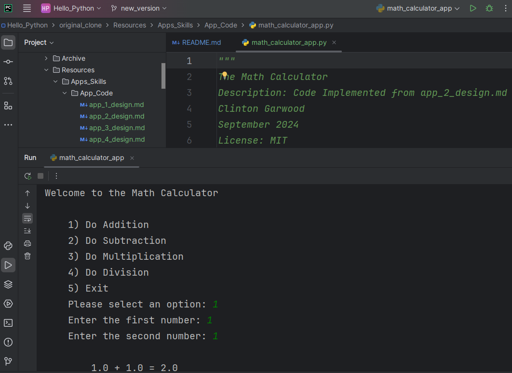

# Hello Python

This repository contains a collection of learning resources which are typically presented in an `Introduction to Programming using Python` undergraduate university computer science course.

Full-Text Resources Include Assignments and Python Source Code Solutions
- Twenty-Four (24) Hands-on Labs (Assignment and Solutions)
- Four (4) Full Applications (Progressive Design Documents and Source Code)

Closed Caption Screen Recordings for All Labs and Apps
- Seventy-Six (76) Linked Screen-Recording Tutorials for all Lab Exercises
- Twenty-One (21) Linked Screen-Recording Tutorials for Applications  

Image of Code and IDE (Code Environment) shown in Tutorial Videos

## Learning Outcomes and Topics
[Full list of Learning Outcomes](Learning_Outcomes.md)
- Basic Programming Techniques
- Object-Oriented Programming Concepts
- Data Structures and Computing Topics
- Application Design and Software Lifecycle Concepts
    
## Skill Labs Topics
[Full list of Skills Labs](Code_Skill_Resources.md)
- Comments and Variables 
- Conditional Statements (If, Else-If, Else)
- For Loop, While Loop, Nested Loops 
- Data Structures as Arrays and Dictionaries
- User Declared Functions 
- Error Handling and Exceptions
- Data Storage, Files, Serialized, Database
- Using Standard Libraries
- Object Oriented Programming 

## Application Development Topics 
[Full list of Apps](Application_Resources.md)
- App 1: Handling User input 
- App 2: Simple Math Calculator using Functions
- App 3: Personal Journal Save Text Data to a File
- App 4: Vocab List/Lookup Object Collection

## Packaged Resources
The Code and Assignments Collection can be downloaded as a zip file [Code and Collection Zip](Code_Assignments_Collection.zip)  
The prototype to that collection, [year_2021](Archive/year_2021) contains only source code, not assignments.

CC by Clinton Garwood and MIT License else &copy; 2025  
